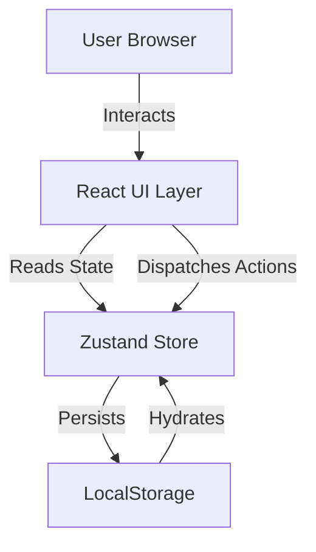
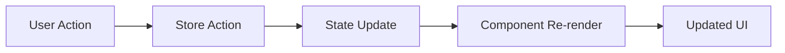
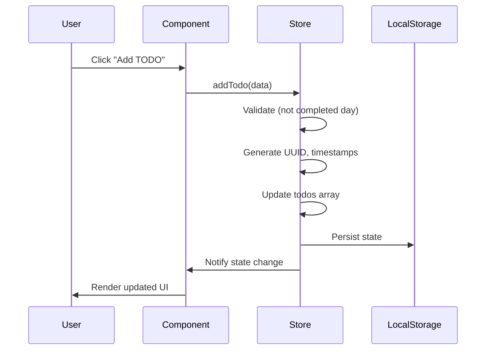
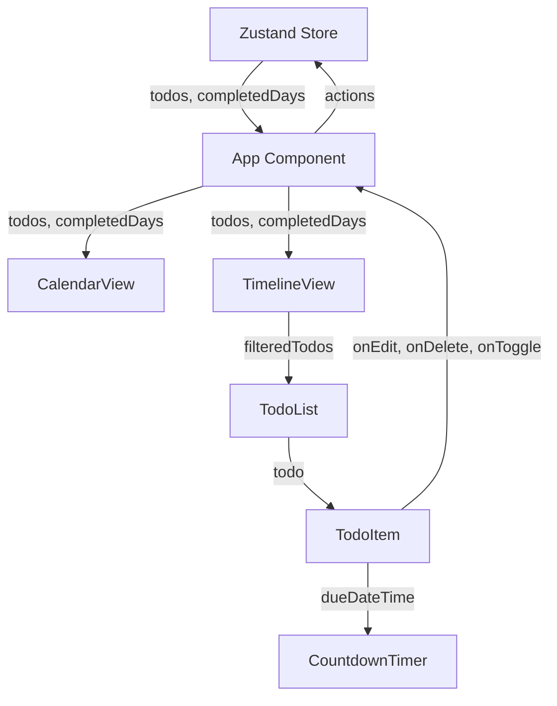

---
tags:
  - architecture
  - design-pattern
  - tech-stack
---

# Architecture

**Last Updated**: 2026-01-14

## Overview

The Todo App is a modern, client-side web application built with React, TypeScript, and Tailwind CSS. It follows a component-based architecture with centralized state management and demonstrates best practices in frontend development.

## Technology Stack

### Core Technologies

| Technology | Version | Purpose |
|------------|---------|---------|
| **React** | 18.3.1 | UI library for building component-based interfaces |
| **TypeScript** | 5.7.2 | Type-safe JavaScript with enhanced developer experience |
| **Vite** | 6.0.5 | Fast build tool and development server |
| **Tailwind CSS** | 3.4.17 | Utility-first CSS framework for rapid UI development |

### State Management

| Technology | Version | Purpose |
|------------|---------|---------|
| **Zustand** | 5.0.2 | Lightweight state management with persistence middleware |

### Utilities

| Technology | Version | Purpose |
|------------|---------|---------|
| **date-fns** | 4.1.0 | Date manipulation and formatting utilities |

### Rationale

- **React**: Industry-standard UI library with excellent performance and ecosystem
- **TypeScript**: Provides type safety, reducing runtime errors and improving maintainability
- **Vite**: Lightning-fast HMR (Hot Module Replacement) for optimal developer experience
- **Zustand**: Minimal boilerplate compared to Redux, built-in persistence support
- **Tailwind CSS**: Rapid prototyping, consistent design system, excellent purge capabilities
- **date-fns**: Modular, tree-shakeable, and TypeScript-friendly date library

## System Architecture

### High-Level Architecture



### Application Structure

```
todo-app/
├── src/
│   ├── App.tsx              # Root component, view orchestration
│   ├── main.tsx             # Application entry point
│   ├── index.css            # Global styles, Tailwind directives
│   ├── components/          # React components
│   │   ├── common/          # Reusable UI primitives
│   │   ├── layout/          # Layout and structure
│   │   ├── calendar/        # Calendar view feature
│   │   ├── timeline/        # Timeline view feature
│   │   └── todo/            # Todo-specific components
│   ├── store/               # State management
│   │   └── useTodoStore.ts  # Zustand store definition
│   ├── types/               # TypeScript type definitions
│   │   └── index.ts         # Shared interfaces and types
│   ├── hooks/               # Custom React hooks
│   │   └── useCountdown.ts  # Real-time countdown hook
│   └── utils/               # Pure utility functions
│       ├── dateUtils.ts     # Date formatting and calculations
│       └── countdownUtils.ts # Countdown logic
├── public/                  # Static assets
├── docs/                    # MkDocs documentation
└── Configuration files      # Vite, TypeScript, Tailwind configs
```

## Design Patterns

### Component Composition

The application follows a **composition pattern** where complex UIs are assembled from smaller, focused components:

```
App
├── Layout
│   ├── Header (view switcher, add button)
│   └── Content Area
│       ├── CalendarView
│       │   └── CalendarDay (multiple)
│       └── TimelineView
│           └── TimelineGroup (multiple)
│               └── TodoList
│                   └── TodoItem (multiple)
│                       └── CountdownTimer
```

**Benefits**:

- Reusability: Components like Button, Modal can be used anywhere
- Testability: Each component can be tested in isolation
- Maintainability: Changes are localized to specific components

### Unidirectional Data Flow

The application implements **Flux-like unidirectional data flow**:

1. **User Action** → Component event handler
2. **Action** → Zustand store action (addTodo, updateTodo, etc.)
3. **State Update** → Store updates state immutably
4. **Re-render** → React components subscribe to state changes



### Container/Presentational Pattern

Components are organized by responsibility:

- **Container Components**: `App.tsx`, `CalendarView`, `TimelineView`
  - Manage state and business logic
  - Connect to Zustand store
  - Handle events and orchestrate child components

- **Presentational Components**: `Button`, `Modal`, `TodoItem`, `CountdownTimer`
  - Receive data via props
  - Emit events via callbacks
  - Focus on UI rendering

### Custom Hooks Pattern

Stateful logic is extracted into reusable hooks:

- `useCountdown`: Encapsulates interval-based countdown logic
- Future hooks: `useTodoFilters`, `useKeyboardShortcuts`, etc.

**Benefits**:

- Logic reuse across multiple components
- Separation of concerns
- Easier testing of stateful behavior

## Data Flow

### State Management Flow



### Component Data Flow



## Folder Structure Rationale

### `/components`
Organized by feature and responsibility:

- **common/**: Framework-agnostic, reusable UI components
- **layout/**: Application structure and navigation
- **calendar/**, **timeline/**, **todo/**: Feature-specific components

### `/store`
Centralized state management:

- Single source of truth for application state
- Actions and selectors co-located with state

### `/types`
TypeScript definitions:

- Shared interfaces prevent duplication
- Single import point for all types

### `/utils`
Pure functions:

- No side effects or external dependencies
- Easily testable
- Organized by domain (date, countdown)

### `/hooks`
Custom React hooks:

- Reusable stateful logic
- Separated from components for clarity

## Performance Considerations

### Code Splitting
- Currently single bundle (suitable for small app)
- Future: Route-based splitting if app grows

### State Management
- Zustand provides minimal re-renders
- Components subscribe only to needed state slices
- Immutable updates prevent unnecessary renders

### Memoization
- CountdownTimer uses interval cleanup
- Date calculations cached where appropriate
- Future: React.memo for expensive components

### Bundle Size
- Vite tree-shaking removes unused code
- Tailwind CSS purges unused styles
- date-fns is modular (only import what's needed)

## Development Workflow

### Local Development
```bash
npm run dev  # Start Vite dev server with HMR
```

### Build
```bash
npm run build  # TypeScript check + Vite build
```

### Preview Production Build
```bash
npm run preview  # Serve production build locally
```

## Related Documentation

- [Components](./components.md) - Detailed component documentation
- [State Management](./state-management.md) - Zustand store implementation
- [Data Models](./data-models.md) - TypeScript interfaces
- [Build & Deployment](./build-deployment.md) - Build configuration
