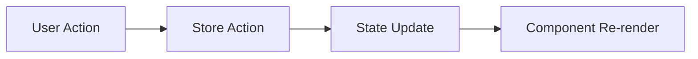
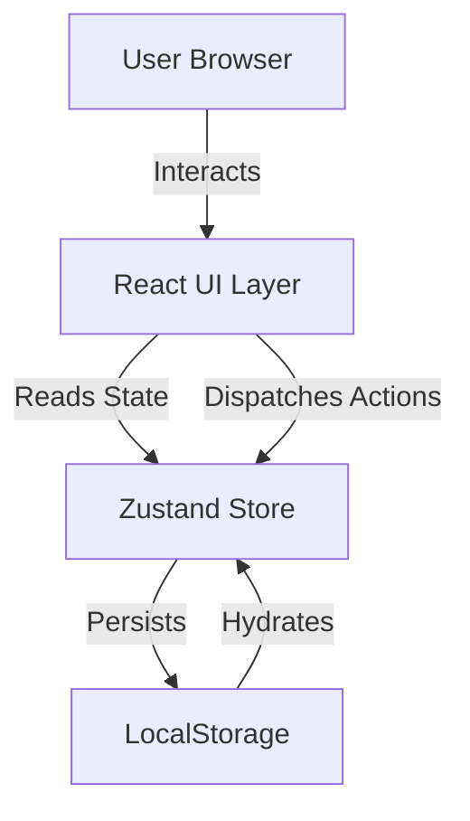

---
tags:
  - architecture
  - design-pattern
  - tech-stack
---

# Architecture

**Last Updated**: 2026-01-15

---

## Tech Stack

### Core Technologies

| Technology | Version | Purpose |
|------------|---------|---------|
| React | 18.3.1 | UI library |
| TypeScript | 5.7.2 | Type safety |
| Vite | 6.0.5 | Build tool |
| Tailwind CSS | 3.4.17 | Styling |

### State Management

| Technology | Version | Purpose |
|------------|---------|---------|
| Zustand | 5.0.2 | State management with persistence |

### Utilities

| Technology | Version | Purpose |
|------------|---------|---------|
| date-fns | 4.1.0 | Date manipulation |

### Documentation

| Technology | Version | Purpose |
|------------|---------|---------|
| MkDocs | Latest | Documentation site generator |
| Material for MkDocs | Latest | Documentation theme |

---

## Folder Structure

```
todo-app/
├── src/
│   ├── App.tsx
│   ├── main.tsx
│   ├── index.css
│   ├── components/
│   │   ├── common/
│   │   ├── layout/
│   │   ├── calendar/
│   │   ├── timeline/
│   │   └── todo/
│   ├── store/
│   │   └── useTodoStore.ts
│   ├── types/
│   │   └── index.ts
│   ├── hooks/
│   │   └── useCountdown.ts
│   └── utils/
│       ├── dateUtils.ts
│       └── countdownUtils.ts
├── docs/
│   ├── mkdocs.yml
│   └── docs/
│       ├── business/
│       └── technical/
└── Configuration files
```

---

## Design Patterns

### Component Composition

```
App
├── Layout
│   ├── Header
│   └── Content Area
│       ├── CalendarView
│       │   └── CalendarDay
│       └── TimelineView
│           └── TimelineGroup
│               └── TodoList
│                   └── TodoItem
│                       └── CountdownTimer
```

### Unidirectional Data Flow



### Container/Presentational Pattern

- **Container Components**: App, CalendarView, TimelineView
- **Presentational Components**: Button, Modal, TodoItem, CountdownTimer

### Custom Hooks Pattern

- `useCountdown` - Countdown timer logic

---

## Data Flow Diagram



---

## Related Documentation

- [Components](components.md)
- [State Management](state-management.md)
- [Data Models](data-models.md)
