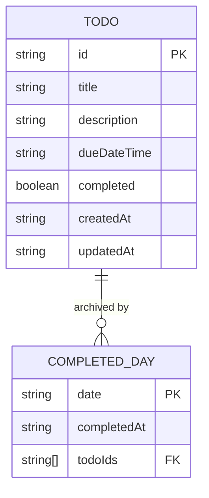

---
tags:
  - type
  - interface
  - model
---

# Data Models

**Last Updated**: 2025-01-15

**Location**: `src/types/index.ts`

---

## Todo

```typescript
interface Todo {
  id: string;
  title: string;
  description: string;
  dueDateTime: string;
  completed: boolean;
  createdAt: string;
  updatedAt: string;
}
```

| Field         | Type    | Description        |
| ------------- | ------- | ------------------ |
| `id`          | string  | UUID v4            |
| `title`       | string  | Todo title         |
| `description` | string  | Additional details |
| `dueDateTime` | string  | ISO 8601 datetime  |
| `completed`   | boolean | Completion status  |
| `createdAt`   | string  | ISO 8601 timestamp |
| `updatedAt`   | string  | ISO 8601 timestamp |

---

## CompletedDay

```typescript
interface CompletedDay {
  date: string;
  completedAt: string;
  todoIds: string[];
}
```

| Field         | Type     | Description          |
| ------------- | -------- | -------------------- |
| `date`        | string   | YYYY-MM-DD format    |
| `completedAt` | string   | ISO 8601 timestamp   |
| `todoIds`     | string[] | Todo IDs on this day |

---

## CountdownTime

```typescript
interface CountdownTime {
  days: number;
  hours: number;
  minutes: number;
  seconds: number;
  isOverdue: boolean;
  totalSeconds: number;
}
```

| Field          | Type    | Description    |
| -------------- | ------- | -------------- |
| `days`         | number  | Days remaining |
| `hours`        | number  | Hours (0-23)   |
| `minutes`      | number  | Minutes (0-59) |
| `seconds`      | number  | Seconds (0-59) |
| `isOverdue`    | boolean | Past due date  |
| `totalSeconds` | number  | Total seconds  |

---

## ViewMode

```typescript
type ViewMode = "calendar" | "timeline";
```

---

## TodoStore

```typescript
interface TodoStore {
  todos: Todo[];
  completedDays: CompletedDay[];

  addTodo: (
    todo: Omit<Todo, "id" | "createdAt" | "updatedAt" | "completed">
  ) => void;
  updateTodo: (
    id: string,
    updates: Partial<Omit<Todo, "id" | "createdAt">>
  ) => void;
  deleteTodo: (id: string) => void;
  toggleTodo: (id: string) => void;
  completeDay: (date: string) => void;
}
```

---

## Type Relationships



---

## Related Documentation

- [State Management](state-management.md)
- [Components](components.md)
