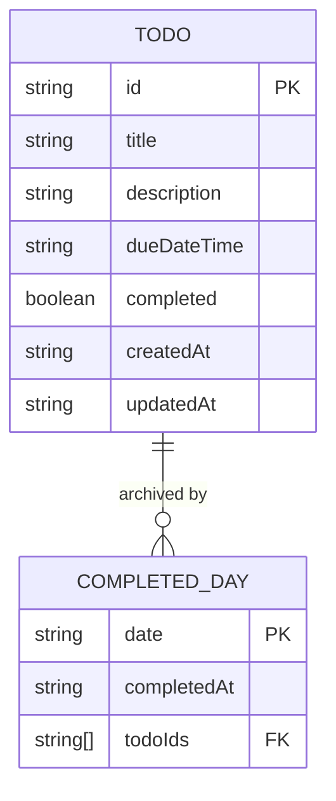

---
tags:
  - type
  - interface
  - model
---

# Data Models

**Last Updated**: 2026-01-14

## Overview

The Todo App uses TypeScript interfaces and types to ensure type safety throughout the application. All data models are defined in a central location for consistency and reusability.

**Location**: [src/types/index.ts](../../../src/types/index.ts)

## Core Interfaces

### Todo

Represents a single todo item with all its properties.

```typescript
interface Todo {
  id: string;                    // UUID (crypto.randomUUID())
  title: string;                 // User-provided title (required)
  description: string;           // Optional description
  dueDateTime: string;           // ISO 8601 format (e.g., "2026-01-14T15:00:00.000Z")
  completed: boolean;            // Completion status
  createdAt: string;             // ISO 8601 timestamp of creation
  updatedAt: string;             // ISO 8601 timestamp of last update
}
```

#### Field Details

| Field | Type | Required | Description |
|-------|------|----------|-------------|
| `id` | string | Yes | Unique identifier (UUID v4) |
| `title` | string | Yes | Todo title, cannot be empty |
| `description` | string | No | Additional details about the todo |
| `dueDateTime` | string | Yes | When the todo is due (ISO 8601) |
| `completed` | boolean | Yes | Whether the todo is complete |
| `createdAt` | string | Yes | When the todo was created (ISO 8601) |
| `updatedAt` | string | Yes | When the todo was last modified (ISO 8601) |

#### Example

```typescript
const exampleTodo: Todo = {
  id: "550e8400-e29b-41d4-a716-446655440000",
  title: "Complete project documentation",
  description: "Write comprehensive technical docs for all components",
  dueDateTime: "2026-01-15T15:00:00.000Z",
  completed: false,
  createdAt: "2026-01-14T10:30:00.000Z",
  updatedAt: "2026-01-14T10:30:00.000Z"
};
```

#### Usage

```typescript
import { Todo } from '../types';

const handleTodo = (todo: Todo) => {
  console.log(todo.title); // Type-safe access
};
```

---

### CompletedDay

Tracks which days have been completed (locked) and which todos were on those days.

```typescript
interface CompletedDay {
  date: string;                  // YYYY-MM-DD format (e.g., "2026-01-13")
  completedAt: string;           // ISO 8601 timestamp of completion
  todoIds: string[];             // Array of todo IDs that were on this day
}
```

#### Field Details

| Field | Type | Required | Description |
|-------|------|----------|-------------|
| `date` | string | Yes | Date in YYYY-MM-DD format |
| `completedAt` | string | Yes | Timestamp when day was completed |
| `todoIds` | string[] | Yes | IDs of todos that existed on this day |

#### Example

```typescript
const exampleCompletedDay: CompletedDay = {
  date: "2026-01-13",
  completedAt: "2026-01-13T23:59:00.000Z",
  todoIds: [
    "550e8400-e29b-41d4-a716-446655440000",
    "6ba7b810-9dad-11d1-80b4-00c04fd430c8"
  ]
};
```

#### Purpose

- Prevents modification of todos on completed days
- Provides audit trail of when days were completed
- Enables "unlock day" feature in future
- Historical record of todo organization

---

### CountdownTime

Represents the countdown state for a todo's due date/time.

```typescript
interface CountdownTime {
  days: number;                  // Days remaining
  hours: number;                 // Hours remaining (0-23)
  minutes: number;               // Minutes remaining (0-59)
  seconds: number;               // Seconds remaining (0-59)
  isOverdue: boolean;            // Whether the due date has passed
  totalSeconds: number;          // Total seconds (absolute value)
}
```

#### Field Details

| Field | Type | Description |
|-------|------|-------------|
| `days` | number | Number of full days remaining |
| `hours` | number | Hours component (0-23) |
| `minutes` | number | Minutes component (0-59) |
| `seconds` | number | Seconds component (0-59) |
| `isOverdue` | boolean | True if current time is past due date |
| `totalSeconds` | number | Total countdown in seconds (absolute) |

#### Example

```typescript
// 2 days, 5 hours, 30 minutes, 15 seconds until due
const exampleCountdown: CountdownTime = {
  days: 2,
  hours: 5,
  minutes: 30,
  seconds: 15,
  isOverdue: false,
  totalSeconds: 192615 // (2*86400) + (5*3600) + (30*60) + 15
};

// 1 hour, 20 minutes overdue
const overdueCountdown: CountdownTime = {
  days: 0,
  hours: 1,
  minutes: 20,
  seconds: 0,
  isOverdue: true,
  totalSeconds: 4800 // 80 minutes in seconds
};
```

#### Usage

Generated by [countdownUtils.calculateCountdown](./utilities.md#calculatecountdown):

```typescript
import { CountdownTime } from '../types';
import { calculateCountdown } from '../utils/countdownUtils';

const countdown: CountdownTime = calculateCountdown("2026-01-15T15:00:00.000Z");
```

---

## Type Aliases

### ViewMode

Defines the available view modes for the application.

```typescript
type ViewMode = 'calendar' | 'timeline';
```

#### Values

- `'calendar'`: Monthly calendar grid view
- `'timeline'`: Chronological list view grouped by date

#### Usage

```typescript
import { ViewMode } from '../types';

const [viewMode, setViewMode] = useState<ViewMode>('calendar');

const handleViewChange = (mode: ViewMode) => {
  setViewMode(mode);
};
```

---

### TodoStore

Interface for the Zustand store, defining state shape and available actions.

```typescript
interface TodoStore {
  // State
  todos: Todo[];
  completedDays: CompletedDay[];

  // CRUD operations
  addTodo: (todo: Omit<Todo, 'id' | 'createdAt' | 'updatedAt' | 'completed'>) => void;
  updateTodo: (id: string, updates: Partial<Omit<Todo, 'id' | 'createdAt'>>) => void;
  deleteTodo: (id: string) => void;
  toggleTodo: (id: string) => void;
  completeDay: (date: string) => void;

  // Selectors
  getTodosByDate: (date: string) => Todo[];
  isDayCompleted: (date: string) => boolean;
  getTodosForDateRange: (startDate: string, endDate: string) => Record<string, Todo[]>;
}
```

See [State Management](./state-management.md) for detailed documentation.

---

## Date Format Standards

### ISO 8601 DateTime

Used for all datetime fields (`dueDateTime`, `createdAt`, `updatedAt`, `completedAt`):

```typescript
"2026-01-14T15:30:00.000Z"
```

**Format**: `YYYY-MM-DDTHH:mm:ss.sssZ`

**Benefits**:

- Unambiguous timezone (UTC)
- Sortable as strings
- Parseable by `new Date()`
- Standard format for date-fns

### YYYY-MM-DD Date

Used for date-only fields (`CompletedDay.date`) and date-based operations:

```typescript
"2026-01-14"
```

**Format**: `YYYY-MM-DD`

**Benefits**:

- Consistent date representation
- Sortable as strings
- Timezone-independent
- Used by [normalizeDate](./utilities.md#normalizedate) utility

---

## Utility Types

### Creating New Todos

When creating todos, certain fields are auto-generated:

```typescript
type NewTodoData = Omit<Todo, 'id' | 'createdAt' | 'updatedAt' | 'completed'>;

// Usage in store action
addTodo: (todo: NewTodoData) => void;

// Example
const newTodoData: NewTodoData = {
  title: "My new todo",
  description: "Details here",
  dueDateTime: "2026-01-15T10:00:00.000Z"
};
```

Fields that are auto-generated:

- `id`: Generated using `crypto.randomUUID()`
- `completed`: Defaults to `false`
- `createdAt`: Set to current timestamp
- `updatedAt`: Set to current timestamp

### Updating Todos

When updating todos, most fields are optional except `id` and `createdAt`:

```typescript
type TodoUpdates = Partial<Omit<Todo, 'id' | 'createdAt'>>;

// Usage in store action
updateTodo: (id: string, updates: TodoUpdates) => void;

// Example
const updates: TodoUpdates = {
  title: "Updated title",
  dueDateTime: "2026-01-16T14:00:00.000Z"
};
```

Fields that can be updated:

- `title`
- `description`
- `dueDateTime`
- `completed`
- `updatedAt` (auto-updated by store)

---

## Data Validation

### Type Guards

Check if data matches expected interface:

```typescript
function isTodo(obj: any): obj is Todo {
  return (
    typeof obj === 'object' &&
    typeof obj.id === 'string' &&
    typeof obj.title === 'string' &&
    typeof obj.description === 'string' &&
    typeof obj.dueDateTime === 'string' &&
    typeof obj.completed === 'boolean' &&
    typeof obj.createdAt === 'string' &&
    typeof obj.updatedAt === 'string'
  );
}
```

### Runtime Validation

For data from external sources (localStorage, API):

```typescript
function validateTodo(data: unknown): Todo {
  if (!isTodo(data)) {
    throw new Error('Invalid todo data');
  }
  
  // Additional validation
  if (!data.title.trim()) {
    throw new Error('Title cannot be empty');
  }
  
  return data;
}
```

---

## Data Relationships



### Relationship Description

- **One CompletedDay** can reference **Many Todos** (via `todoIds` array)
- **One Todo** can be referenced by **One CompletedDay** (todos can only exist on one date)
- Relationship is **soft** (todos remain in store after day completion)
- `todoIds` provides historical record, not enforcement mechanism

---

## LocalStorage Schema

Data is persisted to localStorage in the following structure:

```json
{
  "state": {
    "todos": [
      {
        "id": "550e8400-e29b-41d4-a716-446655440000",
        "title": "Complete project documentation",
        "description": "Write technical docs",
        "dueDateTime": "2026-01-15T15:00:00.000Z",
        "completed": false,
        "createdAt": "2026-01-14T10:30:00.000Z",
        "updatedAt": "2026-01-14T10:30:00.000Z"
      }
    ],
    "completedDays": [
      {
        "date": "2026-01-13",
        "completedAt": "2026-01-13T23:59:00.000Z",
        "todoIds": ["550e8400-e29b-41d4-a716-446655440000"]
      }
    ]
  },
  "version": 0
}
```

**Key**: `todo-storage`

---

## Type Safety Benefits

### Compile-Time Checks

TypeScript catches errors before runtime:

```typescript
const todo: Todo = {
  id: "123",
  title: "Test",
  description: "Test description",
  dueDateTime: new Date(), // ❌ Error: Type 'Date' not assignable to type 'string'
  completed: false,
  createdAt: "2026-01-14T10:00:00.000Z",
  updatedAt: "2026-01-14T10:00:00.000Z"
};
```

### Autocomplete Support

IDEs provide intelligent suggestions:

```typescript
const todo: Todo = {
  // IDE suggests: id, title, description, dueDateTime, completed, createdAt, updatedAt
};
```

### Refactoring Safety

Changing interfaces updates all usages:

```typescript
// Change: title: string -> title: { text: string; language: string }
// TypeScript errors guide refactoring across codebase
```

---

## Related Documentation

- [State Management](./state-management.md) - How interfaces are used in Zustand store
- [Components](./components.md) - Component props using these types
- [Utilities](./utilities.md) - Functions operating on these types
- [Architecture](./architecture.md) - Type safety in overall design
